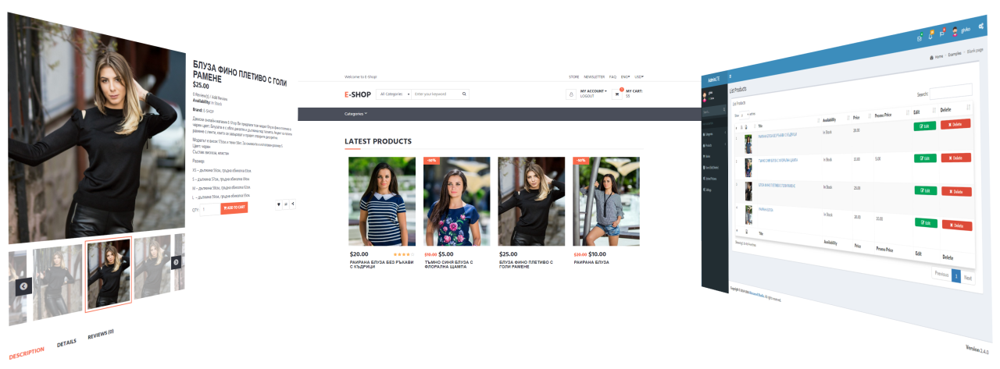

After you copy the project to your folder you need to create a database and import "/temp/web_shop.sql" file and you must set your database access options in "/App/Config.php".

You must place the project in the root folder of hosting or if you put it in a subfolder, you should point it from httpd.conf to the public_html folder where it is placed
Example For Linux with XAMPP
DocumentRoot "/opt/lampp/htdocs/project_folder/public_html"
<Directory "/opt/lampp/htdocs/project_folder/public_html">

Example For Windows with XAMPP
DocumentRoot "C:/xampp/htdocs/project_folder/public_html"
<Directory "C:/xampp/htdocs/project_folder/public_html">

#### Description
  - User registration
  - "Remember me" checkbox on login
  - Restore a forgotten password.
  - Write product review
  - Rate products
  - Search products
  - User can change his own profile data
  - Make Orders with/without logging
  - View products by category
  - Sort category/searching products by newest, lower/higher price
  - MVC architectural pattern
  - CSRF tokens
  - PDO
  - GET/POST/PUT/DELETE requests
  - Notifying the user that the site uses cookies
  - Products pagination
  - AJAX removing products from your cart

#### Admin Can
- Do all CRUD operations on categories/products/users/orders
- Create subcategories
- Block users
- Set picture size and thumbnail size before uploading
- Use my own file manager to select / delete photos (jQuery and AJAX)
- Select site icon
- Select site logo
- Change currency symbol and position (left or right)
- Regular and promo price of product

#### Project Use
  - [BladeOne] - BladeOne Blade Template Engine
  - [AdminLTE] - Control Panel Template
  - [Bootstrap]
  - [jQuery]
  - [E-Shop] - Website template by [Colorlib]
  - [CKEditor 4] - WYSIWYG html editor
  - [Carbon] - A simple API extension for DateTime

After you copy the project to your folder you need to create a database and import "/temp/web_shop.sql" file and you must set your database access options in "/App/Config.php".

You must place the project in the root folder of hosting or if you put it in a subfolder, you should point it from httpd.conf to the public_html folder where it is placed 
Example For Linux with XAMPP 
DocumentRoot "/opt/lampp/htdocs/project_folder/public_html" 
<Directory "/opt/lampp/htdocs/project_folder/public_html"> 
 
Example For Windows with XAMPP 
DocumentRoot "C:/xampp/htdocs/project_folder/public_html" 
<Directory "C:/xampp/htdocs/project_folder/public_html">

[BladeOne]: <https://github.com/EFTEC/BladeOne/>
[AdminLTE]: <https://adminlte.io/>
[Bootstrap]: <https://getbootstrap.com/>
[jQuery]: <https://jquery.com/>
[E-Shop]: <https://colorlib.com/wp/template/e-shop/>
[CKEditor 4]: <https://ckeditor.com/>
[Colorlib]: <https://colorlib.com/>
[Carbon]: <http://carbon.nesbot.com>
